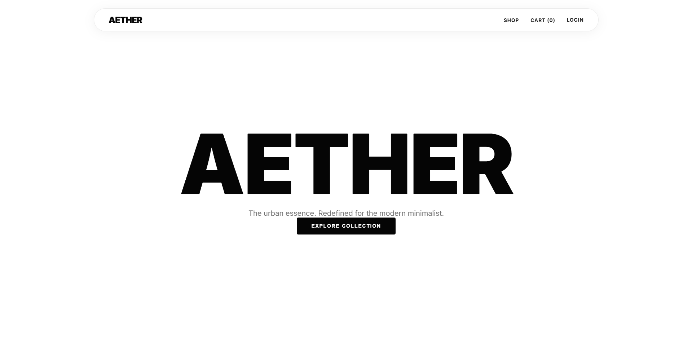

# AETHER | Pure Urban Essence 💎




AETHER is a state-of-the-art, ultra-minimalist e-commerce platform designed for the modern individual. Built with architectural integrity and visual excellence, it delivers a seamless Single-Page Application (SPA) experience for premium urban streetwear.

---

## 🚀 Key Features

- **Fluid SPA Architecture**: Lightning-fast transitions with zero-reload navigation.
- **Brevo Email Integration**: Automated, professional HTML order confirmations and receipts.
- **Robust Guest Checkout**: Minimalist purchase flow capturing essential data without friction.
- **Secure Account Portal**: JWT-powered authentication with a clean, functional dashboard.
- **Smart Catalog**: Real-time inventory tracking, intelligent size selection, and dynamic product discovery.
- **Production-Ready**: Unique order ID generation (`AE-XXXXXX`) and hardened security.

---

## 🎨 Design Philosophy

AETHER is defined by **Aesthetic Precision**:
- **Typography-First**: Cinematic headlines and clean sans-serif layouts.
- **Glassmorphism**: Translucent, floating UI elements for a modern, high-depth feel.
- **Monochromatic Palette**: A sharp combination of Pure White and Onyx Black with Electric Blue highlights.

---

## 🛠️ Technical Stack

- **Frontend**: Vanilla ES6+ JavaScript, CSS3 (Modular System).
- **Backend**: Node.js, Express (Modular MVC).
- **Database**: MongoDB with Mongoose ODM.
- **Authentication**: JWT & LocalStorage state management.
- **Mailing**: Brevo (formerly Sendinblue) SMTP Relay.

---

## 🏁 Getting Started

### 1. Installation
Clone the repository and install dependencies:
```bash
npm install
```

### 2. Environment Configuration
Create a `.env` file based on the `.env.example` provided:
```bash
# Core
MONGODB_URI=your_mongodb_uri
PORT=5000

# Email (Brevo)
EMAIL_HOST=smtp-relay.brevo.com
EMAIL_USER=your_smtp_login
EMAIL_PASS=your_smtp_key
EMAIL_FROM="AETHER Store" <your-verified-sender@domain.com>
```

### 3. Synchronize Catalog
Populate the store with the initial premium collection:
```bash
node seed.js
```

### 4. Launch
Start the AETHER engine:
```bash
npm start
```

Your store will be live at: **[http://localhost:5000](http://localhost:5000)**

---

## 📦 Directory Structure

- `app/` - Core MVC logic (Models, Controllers, Routes).
- `public/` - The SPA engine and premium visual assets.
- `seed.js` - Automated catalog synchronization.
- `server.js` - Modular server entry point.

---

## ⚖️ License
AETHER is a private performance-driven project.

---

**Built with architectural precision by Antigravity.**
